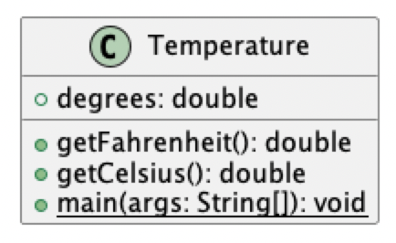
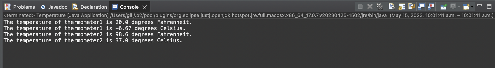

# Temperature report
Author: Balkarn Gill 

## UML class diagram

## Specification

The class Temperature represents a temperature in Fahrenheit and allows computation of the equivalent temperature in Celsius, or, displays the value as it is in Fahrenheit.

## Execution and Testing

