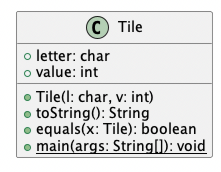
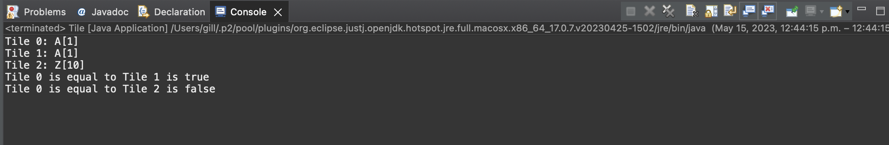

# Tile report
Author: Balkarn Gill 

## UML class diagram

## Specification
 The class Tile represents a character and integer value and allows for computation of the combined string value and then to check if different objects of the class are equivalent.

## Execution and Testing

# Reflection

I liked that the assignment followed the material we learned in lectures. It was challenging to remember the structure but the examples we did during lectures helped a lot.
