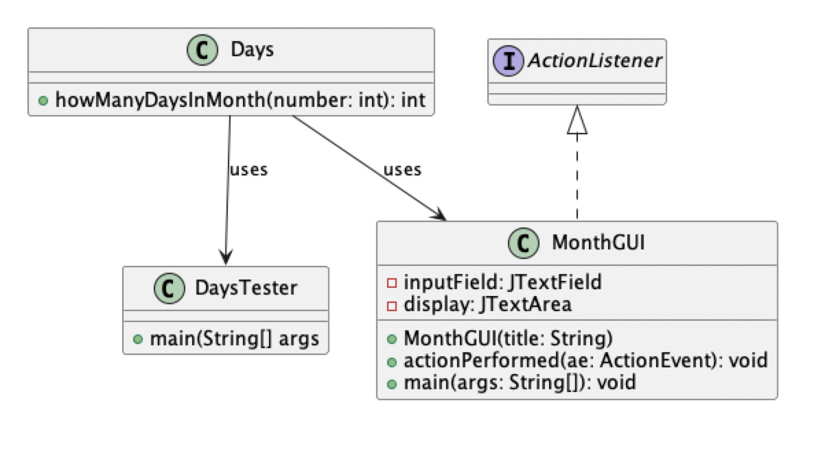
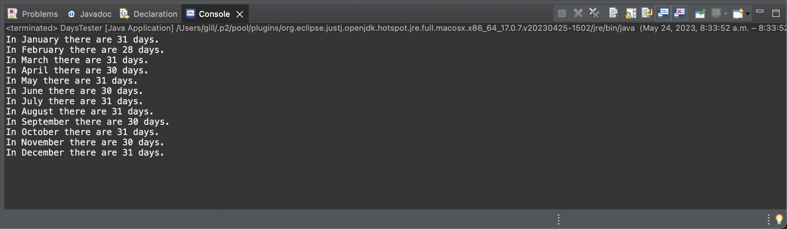
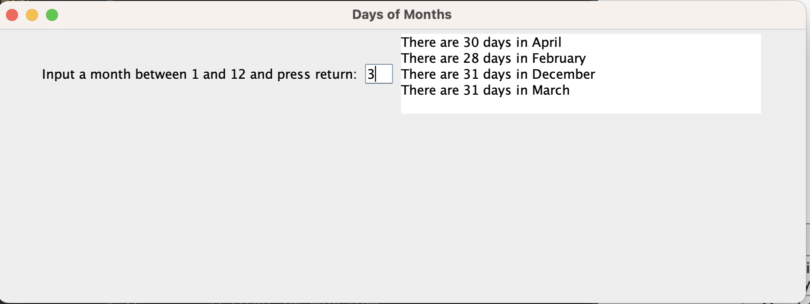

# Days in Month report
Author: Balkarn Gill

## UML class diagram

## Execution and Testing

**Testing `Days` class**

**Days in Month GUI Usage**

Instructions on how to use:

1) Input a month between 1-12 (e.g January = 1, December = 12)
2) Press return
3) Program will output # of days in the chosen month

