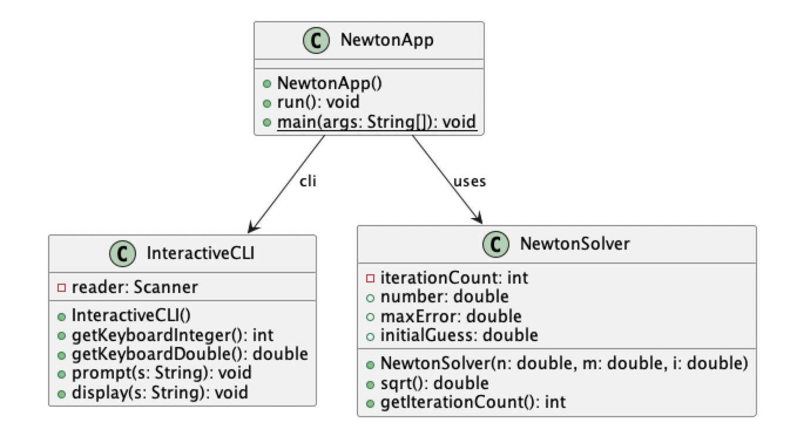
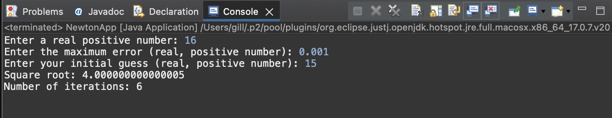
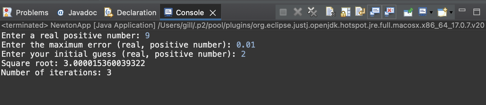
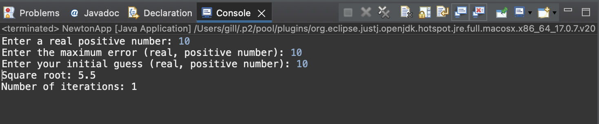

# Newton report
Author: Balkarn Gill 

## UML class diagram

## Execution and Testing
Screenshots demonstrating successful execution and outputs for at least 3 numbers. 

Explain why you chose these numbers for your test:

I chose these numbers to cover a wide range of varying inputs. For the first test scenario, I input a large guess with a small maximum error. I was expecting the program to take more iterations to find the square root and my hypothesis was correct as it took 6 iterations.

For the 2nd test scenario, I chose another perfect square, 9, however, I input a larger max error and an initial guess close to the actual square root. After 3 iterations, the program guessed the square root to be 3.000015360039322, which is very close to the actual square root of 3.0. 

For the last and final test, I wanted to make sure that the program was working correctly by using values that would be easy to calculate. I input 10 as the number, 10 as the max error, and 10 as the initial guess. According to the program's logic, it should output 5.5 as it should only go through 1 iteration with a maximum error this high. 

		double newGuess = ((number / guess) + guess) / 2; 
		double newGuess = ((  10   /  10  ) +   10 ) / 2 = 5.5
		
Sure enough, the program output matched my hypothesis and it was an easy test to validate the logic.

