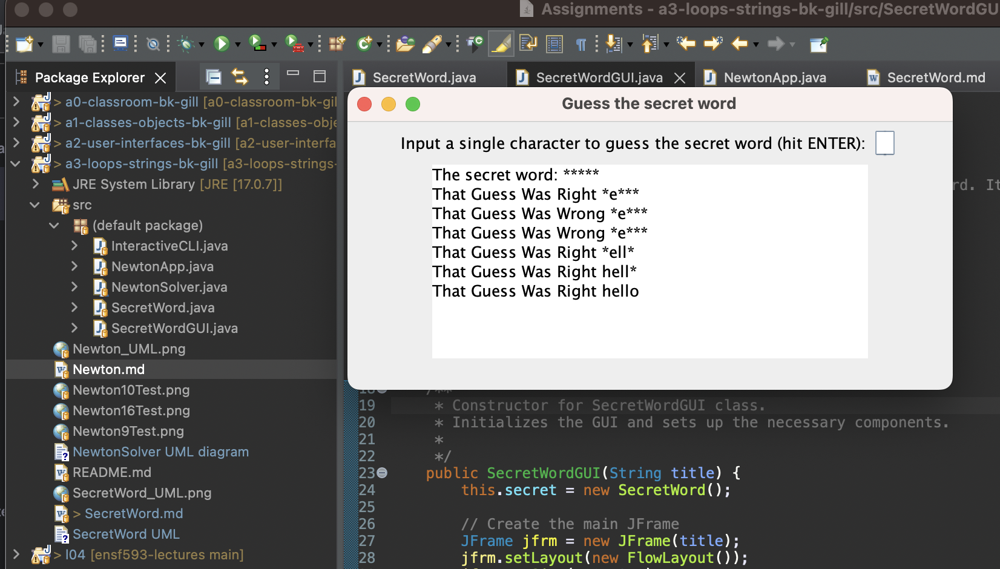

# SecretWord report
Author: Balkarn Gill 

## UML class diagram

## Execution and Testing

# Reflection

The Newton part of the assignment was fairly easy and straight-forward. The secret word assignment was much more challenging. I think it took me at least double the time compared to all the other assignments. However, it was fun and rewarding when completed. 

I am working on a different version that ends the game when the word has been guessed. I may add some other features as well. Overall, I enjoyed this assignment.