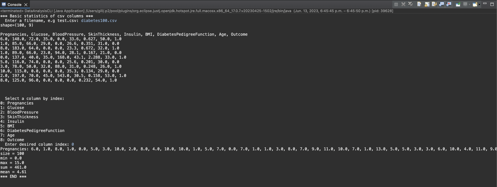

# Data Analysis report
Author: Balkarn Gill

## UML class diagram

## Execution and Testing

## Verification of statistics

# Reflection

This assignment was definitely the most challenging so far. It took me a very long time to get TextAnalyzer to work properly. There were many test scenarios that did not pass at first such as having 
an ending punctuation to begin the input or having multiple consecutively. However, after reviewing
the textbook and other resources, I was able to get it done. The data analysis part was challenging as well but it went much smoother.
